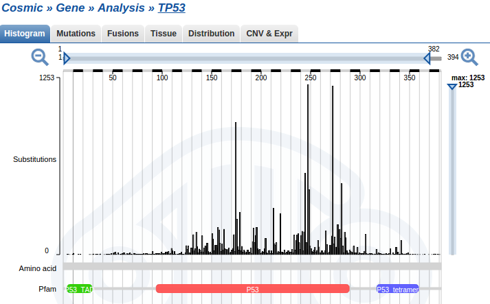

## Rakutsükkel

- Rakutsükkel on järjestikuste sündmuste jada mille käigus rakk duplitseerib kõik oma koostisosad ja jaguneb kaheks tütarrakuks.
- **Raku rakutsüklisse sisenemist reguleerivad raku väliskeskkonna signaalid**.
- Mittejagunev rakk on vaikeolekus (*quiescence*) ehk **G0** faasis.

---
## Rakku jagunema/mittejagunema mõjutavad signaalid

**Rakk on tundlik väliskeskonna signalisatsioonile varases ja keskmises G1 faasis**.

- $\uparrow$ türosiin kinaas retseptorid (mitogeenid).
- $\uparrow$ G-valk retseptorid (GPCR).
- $\downarrow$ TGF-$\beta$ retseptorid, TGF-$\beta$ on üks prominentsemaid anti-mitogeene.
- $\downarrow$ toitainestaatus.

---
## Tsükliinid ja CDK inhibiitorid

- Kasvufaktorid stimuleerivad kiire tsükliin D taseme tõusu rakus ja CDK4/6 aktivatsiooni.
- Anti-mitogeenne TGF-$\beta$ signalisatsioon aktiveerib p15^INK4B tsükliini kinaasi inhibiitori.

---
## RB kontrollib restriktsioonipunkti

- Peale R punkti on rakutsükli regulatsioon automaatne ja ei allu enam mitogeensele-anti-mitogeensele kontrollile.
- R punkti läbimist reguleerib
      - RB hüpofosforüleerimine tsükliin D-CDK4/6 poolt ja
      - hüpofosfo-RB hüperfosforüleerimine tsükliin E-CDK2 poolt.

---
## Kasvajates on rakutsükkel dereguleeritud

[Kuni 90% vähke sisaldab muutusi rakutsükli regulatsioonis.](http://tpall.github.io/Rakutsyklikontroll/cellcyclecancer.html)

---.segue .dark .nobackground
## TP53

---
## p53 avastamine

- 1979. aastal esitasid kuus sõltumatut uurimisrühma andmed, et nad on avastanud 53 kDa valgu inimese ja hiirte rakkudest ([DeLeo et al. 1979](http://www.ncbi.nlm.nih.gov/pmc/articles/PMC383613/), [Kress et al. 1979](http://www.ncbi.nlm.nih.gov/pmc/articles/PMC353470/), [Lane & Crawford 1979](http://www.nature.com/nature/journal/v278/n5701/abs/278261a0.html), [Linzer & Levine 1979](http://www.sciencedirect.com/science/article/pii/0092867479902939), [Melero et al. 1979](http://www.sciencedirect.com/science/article/pii/0042682279902502), [Smith et al. 1979)](http://www.sciencedirect.com/science/article/pii/0092867479900539). 
- Viiel juhul avastati see valk sellepärast, et see immuunosadestus koos SV40 viirusvalguga suur T-antigeen (*large T-antigen*). 
- Sama valk avastati ka pooljuhuslikult kui keemiliselt transformeeritud sarkoomirakkude vastu genereeritud antiseerum tundis ära 53 kDa valgu transformeerunud rakkudest, kuid mitte normaalsetes rakkudes.

---
# Onkoviiruste märklauaks on pRb, p53 ja apoptoos

Viirus | Viirusvalk mille märklauaks on Rb | Viirusvalk mille märklauaks on p53 | Viirusvalk mille märklauaks on apoptoos
-------|------------|---------------|-------------
SV40 | suur T (*large T antigen*) | suur T | 
adenoviirus | E1A | E1B55K | E1B19K
HPV | E7 | E6 | 
polüoomiviirus | suur T | suur T? | keskmine T (*middle T*)
herpesviirus saimiri | V tsükliin (D tsükliini homoloog) | | v-Bcl-2
HHV-8 (KSHV) | K tsükliin (D tsükliini homoloog) | LANA-2 | v-Bcl-2, v-FLIP
HCMV | IE72 | IE86 | vICA, pUL37
HTLV-I | Tax | | 
Epstein-Barr | | EBNA-1 | LMP-1

---
## p53 peeti algselt onkogeeniks

- 1980.ndate alguses oli tuumorsupressorgeenide kontseptsioon veel väga teoreetiline ja viirustest isoleeritud rakulisi onkogeene peeti võtmeks vähi olemuse mõistmisel. 
- **p53 seostus SV40 viiruse peamise onkogeeni - suur T-antigeeniga**, viidates et ta kuulub miskitmoodi suur Tag "signaaliraja"" koosseisu.
- **p53 oli paljudes kasvajates üle-ekspresseeritud**.
- **"Normaalse" p53 viimine normaalsetesse rakkudesse oli võimeline põhjustama rakkude transformeerumise**.


<p style="font-size:12pt">p53 immuunovärvimine metastaatilises rinnavähis (paremal) võrreldes normaalse koega (vasakul). Pilt: doi:10.1038/srep02246</p>

---
## p53 on klassikaline "*two-hit*" tuumorsupressor

- p53 ilmus jäädavalt radarile kui käärsoolevähist otsiti oletatavat tuumorsupressorgeeni kromosoomi 17p lookusest ([Baker et al. 1989](https://www.msu.edu/~luckie/paris/290B/Vogelstein.pdf)).
- Enamuses käärsoolevähkides olid p53 geenis aminohappe asendusi põhjustavad missens mutatsioonid (C $\rightarrow$ T).
- Kõigil juhtudel oli p53 geeni mõlemad koopiad muteerunud: üks koopia sisaldas mutatsioone ja teine koopia oli täielikult kaduma läinud (LOH). 
- p53 oli muteerunud väga erinevates vähkides ([Nigro et al. 1989](http://www.nature.com/nature/journal/v342/n6250/abs/342705a0.html))

---
## p53 mutatsioonisagedused kasvajates

```{r prevalence, echo=FALSE, results='asis'}
library(plyr)
library(magrittr)
library(ggplot2)
prev <- read.delim("~/Dropbox/Onkobioloogia/p53-ja-apoptoos/PrevalenceIARC TP53 Database, R17.txt")
sum <- prev %>% ddply(.,"Topography", summarise, samples=sum(Sample_analyzed), 
                                             mutated=sum(Sample_mutated), 
                                             percent=(mutated/samples)*100) %>%
  filter(samples>500)
lab <- lapply(strwrap(sum$Topography,50,simplify=F),paste,collapse="\n")
sum %>% qplot(x=reorder(Topography,percent), y=percent, data=., geom='bar',stat="identity") + 
  labs(y="% mutated",x=NULL) +
  scale_x_discrete(labels=lab) +
  coord_flip() + theme(axis.text=element_text(colour = "black"))
```
<p style="font-size:10pt">IARC TP53 Database R17, November 2013. Petitjean A, Mathe E, Kato S, Ishioka C, Tavtigian SV, Hainaut P, Olivier M. Impact of mutant p53 functional properties on TP53 mutation patterns and tumor phenotype: lessons from recent developments in the IARC TP53 database.Hum Mutat. 2007 Jun;28(6):622-9.</p>

--- &twocol 
## TSG mutatsioonid


***=left

- TSG sisaldavad laias laastus kahte tüüpi mutatsioone, 
      - ühed viivad valgu osalise või täieliku trunkeerumiseni nt. APC, CDKN2A, 
      - teised põhjustavad aminohappe asendusi (*missens* mutatsioonid).
- p53 kuulub selliste TSG hulka milles on kõige sagedasemad aminohappe asendusteni viivad mutatsioonid.
- Võib oletada, et selline *missens* mutatsioone sisaldav tuumorsupressor valk annab vähirakkudele mingi selektsioonilise eelise.

***=right


<p style="font-size:10pt">Andmed: TOP 5% enim mutatsioone sisaldavad TSG (kokku 637 TSG-st). TSG-d Vanderbilt University andmebaasist ja mutatsioonid COSMIC andmebaasist, cancer.sanger.ac.uk.</p>

---
## p53 mutatsioonid asuvad peamiselt DNA sidumise domäänis



---
## p53 mutandid on dominant negatiivsed

- p53 toimib homotetrameerina.
- Kui rakus on näiteks üks p53 alleel muteerunud, siis see mutantne p53 moodustab komplekse *wild-type* p53 ja inaktiveerib need.
- Tetrameeride puhul on kombinatoorikast lähtudes ainult 1/16 p53 kompleksist täielikult *wild-type* ehk aktiivne.
- Kui rakus oleks mutantse p53 alleeli ekspressioon täielikult inaktiveeritud, siis säiliks ikkagi p53 *wild-type* funktsioon.
- Kasvajates p53 muteerunud siiski (kuni 50%) ja läbinud LOH sündmuse.


---
## p53 reguleeritakse valgu stabiilsuse läbi

- Normaalsetes, mitte stressis olevates rakkudes on p53 väga ebastabiilne poolestusajaga 5-30 min.
- Selline kiire tsükkel võimaldab rakul kiiresti vastata füsioloogilistele signaalidele.
- Ksenotoksilised agendid indutseerivad p53 minutite jooksul.
- Selline induktsioon ei ole tingitud p53 mRNA taseme tõusust.
- p53 valgu tase tõuseb rakkudes täielikult tingituna post-translatsioonilistest modifikatsioonidest mis tõstavad selle normaalselt labiilse valgu stabiilsust.


---&twocol
## p53 indutseerib stress

***=left

Stiimuli tüüp | stiimul
--------------|--------
stress | hüpoksia, nukleotiidide puudus, UV kiirgus, ioniseeriv kiirgus, RNA- või DNA sünteesi blokk, madal pH, NO, DNA kahjustused, kemoteraapia
onkogeenne signalisatsioon | MYC, E2F1 üle-ekspressioon, DNA demetülatsioon

***=right
- **p53 taseme tõus rakkudes viib pöörduva või pöördumatu (*senescence*) rakutsükli arrestini**.
- p53 aktiveerib DNA reparatsiooni raja.
- p53 blokeerib angiogeneesi (TSP-1$\uparrow$).
- **p53 indutseerib apoptoosi**

---
## p53 indutseerib p21 transkriptsiooni

- p21 vahendab p53 rakutsüklit inhibeerivat efekti, samas p21 inhibeerib p53-sõltuvat apoptoosi.


---
## DNA kahjustused ja onkogeenid stabiliseerivad p53

Peamised p53 stabilisatsiooni rajad
- dsDNA kahjustus, ioniseeriv kiirgus, telomeeride lühenemine aktiveerib ATM $\to$ Chk2 raja.
- ssDNA, UV kiirgus, replikatsioonistress, kemoterapeutikumid akiveerivad ATR (*ATM–Rad3-related protein*) $\to$ Chk1 raja.
- p53 fosforüleeritakse amino terminusest Ser-15, Ser-37 jt.
- Amino-terminaalne fosforüleerimine blokeerib **MDM2** sidumise p53.
- Myc või E2F1 aktivatsioon viib rakus **p19^ARF** valgu taseme ülesse, mis blokeerib MDM2 ja võib viia rakud apoptoosi.


---&twocol
## MDM2

***=right

- MDM2 avastati kui *double-minute* kromosoomid hiire sarkoomirakkudes (_**mo**use **d**ouble **m**inutes_).
- **Mdm2 on E3 ubikvitiin ligaas** mis tunneb ära p53 amino-terminaalse trans-aktivatsiooni domääni.
- Mdm2 on p53 märklaudgeen.
- MDM2 ekspressiooni indutseerib ka mitogeenne signalisatsioon läbi MAPK raja (AP-1 TF).
- Samuti stabiliseerib MDM2 Akt/PKB, mille poolt fosfoforüleerimine blokeerib MDM2 auto-ubikvitineerimise.

<p style="font-size:12pt">Double-minute kromosoomid on ekstrakoromosomaalne DNA kasvajates mis on tekkinud geeniamplifikatsiooni tagajärjel.</p>

***=left


---
## ARF

- p19^ARF (hiir) või p14^ARF (inimene) valku kodeerib kompaktne geneetiline lookus kus asub kokku kolm tuumorsupressorgeeni: p16^INK4A, p15^INK4B ja p19/p14^ARF .
- ARF geeni promootor asub 13 kB ülevalpool p16^INK4A promootorist. ARF - _**a**lternative **r**eading **f**rame_.
- **ARF seob MDM2** ja inhibeerib selle korjates ta tuumakesse.
- ARF ekspressiooni aktiveerivad c-MYC, RAS ja ka adenoviiruse E1A.


<a href="http://www.hhmi.org/research/arf-tumor-suppression-stem-cells-and-cancer" target="_blank"style="font-size:12pt">Pilt:HHMI</a>

---
## Rb funktsiooni kadumine käivitab ka apoptoosi programmi

- E2F liigse aktiivsuse puhuks on evolutsiooniliselt kujunenud mehhanism, mis elimineerib normaalse pRb kontrolli kaotanud rakud.
- Kõrge E2F1 aktiveerib mitmete apoptootiliste geenide transkriptsiooni: kaspaasid (3,7,8,9), pro-apoptootilised Bcl2 valgud (Bim, Noxa, PUMA), Apaf-1 ja p73 (p53 homoloog).
- E2F1/2 reguleerib ka p53-sõltuvat apoptoosi indutseerides p14^ARF .

RB-sõltuv apoptoosi rada: **pRb** $\dashv$ **E2F** $\to$ **ARF** $\dashv$ **MDM2** $\dashv$ **p53** $\to$ **apoptoos**

---
Valik p53 märklaud geene. Kokku on ~120 geeni leitud.

Geeni funktsionaalne klass | Geen | Funktsioon
---------------------------|------|------------
p53 antagonist | MDM2 | p53 ubikvitiinligaas
rakutsükli inhibiitorid | p21^CIP1 | CDK inhibiitor
  | Siah-1 | ubikvitiinligaas, $\beta$-kateniini lagundamine
  | 14-3-3$\sigma$ | tsükliin B-CDK1 inhibiitor
  | Reprimo | G2 arrest
DNA reparatsioon  | p53R2 | DNA biosüntees
 | XPE/DDB2, XPG, XPC | NER (*nucleotide excision repair*)
 | GADD45 | NER (*nucleotide excision repair*)
 | DNA pol. $\kappa$ | DNA polümeraas
apoptoos | BAX | mt poorivalk 
 | PUMA, NOXA | BH3 mt poorivalk
 | APAF1 | kaspaas-9 aktivaator
 | NF-$\kappa$B | TF
 | Fas/APO1 | surmaretseptor
anti-angiogenees | TSP-1 (trombospondiin) | *ECM* valk

---
## p53 anti-neoplastiline toime on peamiselt tingitud apoptoosi induktsioonist

- p53 aktiveerib Fas/APO1 ja mitmete Bcl-2 pro-apoptootiliste geenide transkriptsiooni.
- p53-indutseeritud apoptoos kulgeb peamiselt läbi tsütokroom c vabanemise mitokondrist ja kaspaaside aktivatsiooni.

---
## Apoptoosi mehhanismid

- Vastusena apoptootilistele stiimulitele aktiveeritakse kõigepealt initsiaator kaspaasid(kaspaas-2,-8,-9,-10) mis aktiveerivad omakorda effektor kaspaasid (kaspaas-3 või -7).
- Kaspaaside kaskaadi aktiveerimine käivitab raku valkude proteolüütilise lagundamise ja rakusurma.
- Selliselt surnud rakud fragmenteeruvad vesiikuliteks ja fagotsüteeritakse teiste rakkude poolt.
- **Apoptoos käivitatakse rakkudes läbi kahe mehhanismi**: rakkude sisemine vastus stressile ja ligand indutseeritud.
- Rakkude sisemine mehhanism käib üle **tsütokroom c vabanemise mitokondrist** ja indutseeritud mehhanism käib läbi **surmaretseptorite**.


---
## Mitokondriaalne apoptoos


---
## Surmaretseptorid


---
## Kasvajates dereguleeritud apoptoosirajad

---
## Lingid eelmistele loengutele

1. [Sissejuhatav loeng](http://rpubs.com/tapa741/sissejuhatus)

2. [Vähitüübid](http://rpubs.com/tapa741/vahityybid)

3. [Onkoviirused](http://tpall.github.io/Onkoviirused)

4. [Onkogeenid](http://tpall.github.io/Onkogeenid)

5. [Retseptorid](http://tpall.github.io/Retseptorid)

6. [Signaalirajad](http://tpall.github.io/Signaalirajad)

7. [Tuumorsupressorgeenid](http://tpall.github.io/Tuumorsupressorid)

8. [Rakutsüklikontroll](http://tpall.github.io/Rakutsyklikontroll)